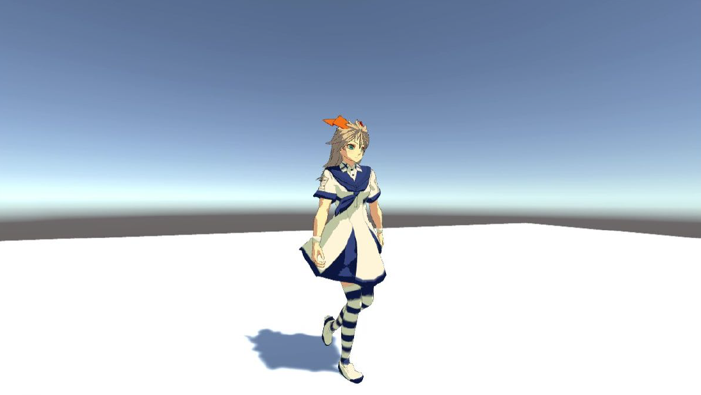

# SmartRig Biped Sample

[Watch on Youtube](https://youtu.be/LlzCTsNxVdc)

## License
- MIT License

## Tested Environment
- Unity 2018.4.17f1
- Windows 10 Pro

## Third party assets
You need to import the following assets from Unity Asset Store.

- [SmartRig Biped](https://assetstore.unity.com/packages/tools/animation/smartrig-biped-134814)

The following assets are included in this project.

- [School Costume Unity-chan from The Phantom Knowledge. (Humanoid Edition)](http://unity-chan.com/download/download.php?id=TPK-Hmnd-Kohaku_B&v=1.1)  
Licensed under the UCL2.0. (C) Unity Technologies Japan/UCL.  
